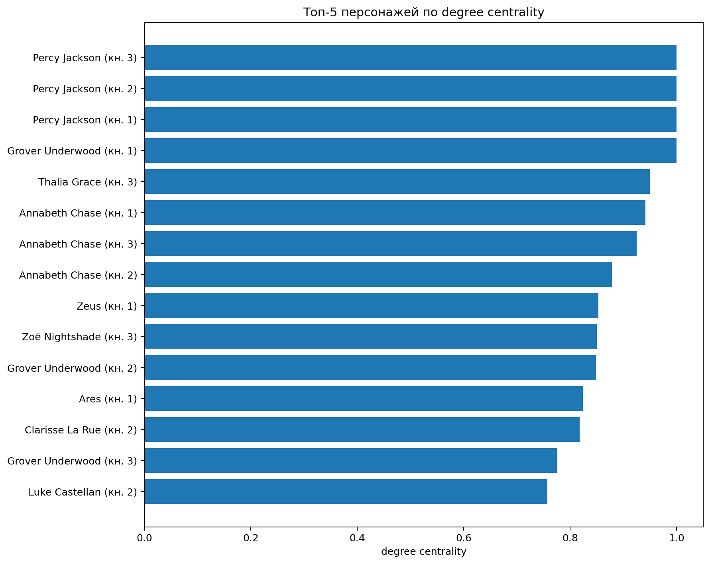
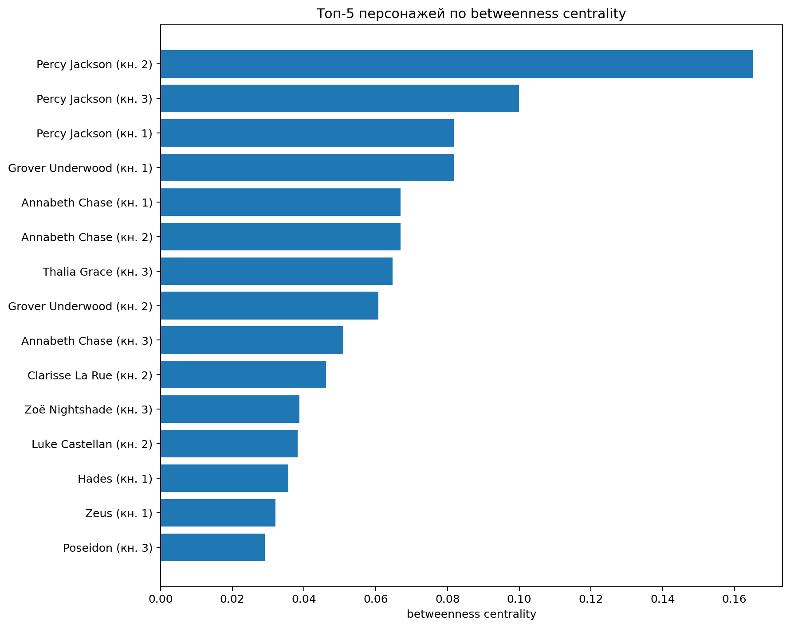

```{python}
from pathlib import Path
import pandas as pd
from IPython.display import display

ROOT = Path.cwd()
if not (ROOT / "results").exists():
    ROOT = ROOT.parent

summary = pd.read_csv(ROOT / "results/tables/network_summary.csv")
metrics = pd.read_csv(ROOT / "results/tables/character_metrics.csv")
edges = pd.read_csv(ROOT / "data/processed/edges_by_book.csv")
```

## 1. Исследовательский вопрос и гипотеза

**Исследовательский вопрос:** как меняется структура сети совместных упоминаний персонажей в первых трёх книгах цикла Рика Риордана «Перси Джексон и олимпийцы», и какие персонажи играют наиболее важную роль с точки зрения degree centrality и betweenness centrality?

**Гипотеза:** Перси Джексон будет занимать центральную позицию во всех трёх книгах, поскольку повествование ведётся от первого лица. При этом состав персонажей с высокой центральностью будет меняться вместе с основной группой участников квеста.

## 2. Предыдущие исследования

Сетевой подход к литературе позволяет рассматривать персонажей как узлы, а их отношения или совместные появления — как рёбра. Франко Моретти использовал положение персонажей в сети для интерпретации их повествовательной функции на материале драматических произведений. Дэвид Элсон, Николас Деймс и Кэтлин Маккеон предложили автоматическое извлечение социальных сетей из художественной прозы. Обзор Винсента Лабатю и Ксавье Боста показывает, что итоговая структура сети зависит от способа распознавания персонажей и определения связи.

Наш проект использует более простой и прозрачный способ: словарь имён и окно совместной встречаемости, которые мы использовали на занятиях :D

## 3. Данные

Корпус состоит из первых трёх книг серии в формате TXT. Исходный датасет опубликован на Kaggle. Полные тексты в папке data/raw;

Словарь `data/characters.csv` объединяет разные обозначения одного персонажа: например, `Chiron`, `Mr. Brunner` и `Brunner` относятся к одному узлу.

Поскольку повествование ведётся от первого лица, местоимения `I`, `me`, `my`, `mine`, `myself` считаются указанием на присутствие Перси. Это специальное правило необходимо, иначе его роль была бы искусственно занижена.

## 4. Метод

Тексты предварительно очищаются от оглавлений, рекламных фрагментов и заголовков глав. Чтобы различия в ширине строк исходных TXT не влияли на результат, текст каждой главы повторно разбивается на строки длиной около 80 символов (в том числе, чтобы исследователю было легче перепроверять результат)

Далее применяется изученная на занятиях логика окна:

1. Скрипт находит персонажа в текущей строке — это `Source`.
2. Рассматривает окно из пяти строк до и пяти строк после неё.
3. Для каждого другого персонажа подсчитывает число строк окна, где он упомянут.
4. Пары `A–B` и `B–A` приводятся к единому алфавитному порядку.
5. Веса одинаковых пар суммируются.

Получается неориентированный взвешенный граф. Для каждой книги рассчитываются:

- число узлов;
- число рёбер;
- плотность;
- degree centrality;
- betweenness centrality.

## 5. Общая структура сетей

```{python}
display(summary.round(3))
```

{fig-alt="Сравнение сетей трёх книг"}

Во второй книге сеть содержит меньше узлов и рёбер и имеет самую низкую плотность. В третьей книге число персонажей и связей возрастает, а плотность снова повышается, хотя остаётся немного ниже показателя первой книги. Рост числа узлов и рёбер соответствует расширению ансамбля: к центральной группе присоединяются охотницы Артемиды, ди Анджело, боги и персонажи сюжетной линии Атласа.

## 6. Центральные персонажи

```{python}
for book in sorted(metrics["book"].unique()):
    print(f"Книга {book}: топ-5 по degree centrality")
    display(
        metrics[metrics["book"] == book]
        .sort_values("degree_centrality", ascending=False)
        .head(5)[["character", "degree_centrality", "betweenness_centrality"]]
        .round(3)
    )
```

Перси занимает первое место или делит его во всех книгах. В первой книге наиболее центральны также Гроувер и Аннабет, что логично, потому что они формируют тройку для квеста. Во второй книге в ядро входят Тайсон, Кларисса и Люк, что отражает конфликт вокруг лагеря и путешествие за Золотым руном. В третьей книге особенно заметны Талия и Зои: их высокие показатели связаны с тем, что через них соединяются разные группы персонажей и сюжетные линии, в том числе конфликт Талии и Зои и тем, что Талия становит важной для общесквозной для всей серии книг сюжета пророчества.

{fig-alt="Топ персонажей по degree centrality"}

{fig-alt="Топ персонажей по betweenness centrality"}

## 7. Самые сильные связи

```{python}
for book in sorted(edges["book"].unique()):
    print(f"Книга {book}")
    display(
        edges[edges["book"] == book]
        .sort_values("weight", ascending=False)
        .head(10)
    )
```

Самые сильные связи во всех книгах связаны с Перси, что частично объясняется первым лицом повествования. При этом партнёр с наиболее сильной связью меняется: Гроувер в первой книге, Аннабет и Тайсон во второй, Талия и Зои в третьей.

## 8. Интерактивные сети

### Книга 1

<iframe class="network-frame" src="results/networks/book_1_network.html"></iframe>

### Книга 2

<iframe class="network-frame" src="results/networks/book_2_network.html"></iframe>

### Книга 3

<iframe class="network-frame" src="results/networks/book_3_network.html"></iframe>

Размер узла зависит от degree centrality. Толщина ребра равна квадратному корню из веса, как в учебной тетрадке; это уменьшает визуальный разрыв между самыми частотными и редкими связями.

## 9. Ограничения

1. **Совместное упоминание не равно прямому взаимодействию.** Персонажи могут оказаться рядом из-за воспоминания, сравнения или рассказа о прошлом.
2. **Первое лицо усиливает Перси.** Специальное правило для местоимений необходимо, но делает его связи особенно частотными.
3. **Словарь составлен вручную.** Пропущенный вариант имени уменьшает число связей; неоднозначное имя может создать ложное совпадение.
4. **Размер окна влияет на сеть.** Окно ±5 строк выбрано потому, что именно этот метод использовался на занятиях, но другое окно дало бы другие веса и плотность.
5. **Degree и betweenness считаются по наличию рёбер.** Вес используется для визуальной силы связи, но не как расстояние при расчёте betweenness: большой вес означает близость, тогда как NetworkX по умолчанию трактует вес как длину пути.

## 10. Выводы

Гипотеза подтвердилась: Перси остаётся структурным центром всех трёх сетей. Однако сетевой анализ показывает не только очевидное главенство рассказчика, но и изменение ансамбля. Первая книга организована вокруг базовой троицы Перси — Гроувер — Аннабет; во второй структурно усиливаются Тайсон, Кларисса и Люк; в третьей центральное место получают Талия и Зои. Таким образом, изменения сетевых метрик соответствуют перестройке основной квестовой группы и расширению мира серии.

## 11. Перспективы

Дальнейшее развитие проекта может включать оставшиеся две книги, проверку нескольких размеров окна и отдельное сравнение сети явных имён с сетью, где учитываются местоимения рассказчика. А также другая серия - например, в "Герои Олимпа" Перси уже говорит от третьего лица, что упростит поиск его.
