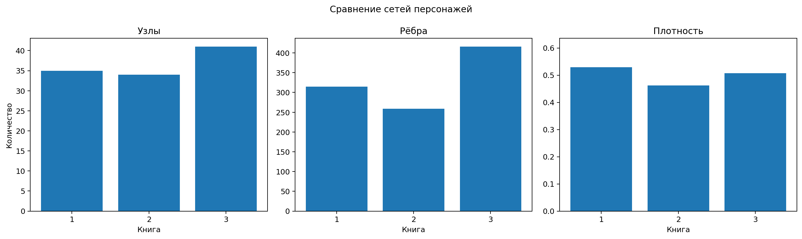

::: {.hero}
Проект исследует не только то, **кто чаще всего появляется в книгах**, но и то, **какое место персонаж занимает в структуре повествовательной сети**.
:::

## Исследовательский вопрос

**Как меняется структура сети совместных упоминаний персонажей в первых трёх книгах цикла и какие персонажи занимают центральные и посреднические позиции в каждой книге?**

## Основной результат

Перси сохраняет центральную позицию во всех книгах, однако состав ближайшего структурного ядра меняется вместе с сюжетом. В первой книге его формируют Гроувер и Аннабет; во второй заметно усиливаются Тайсон, Кларисса и Люк; в третьей наиболее центральными второстепенными персонажами становятся Талия и Зои.

{fig-alt="Сравнение числа узлов, рёбер и плотности сетей трёх книг"}

## Страницы проекта

- [Исследовательский текст](analysis.qmd)
- [Полная Jupyter-тетрадка](notebooks/percy_network_analysis.ipynb)
